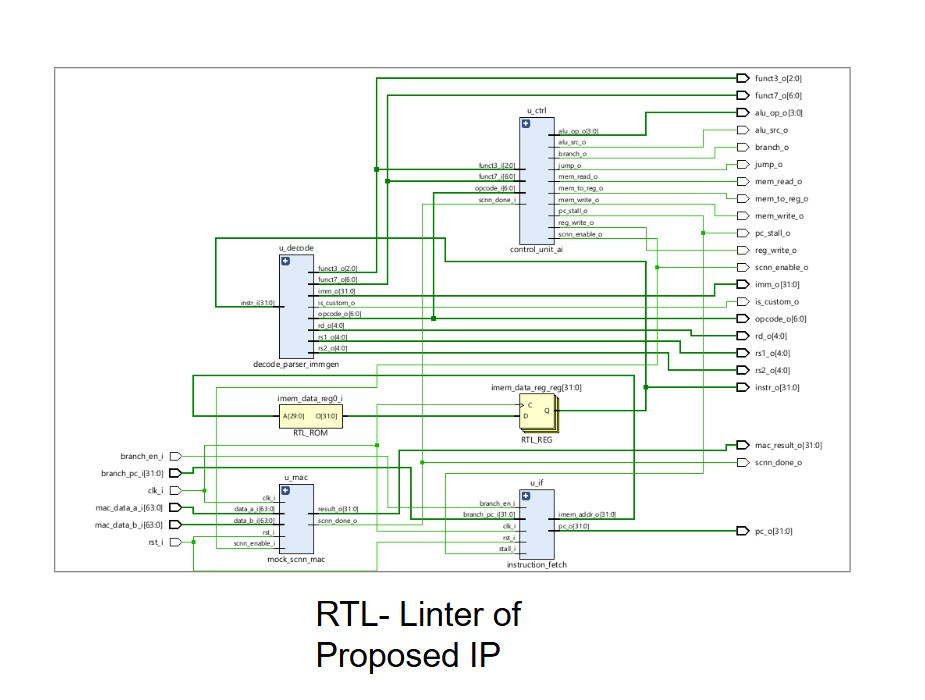
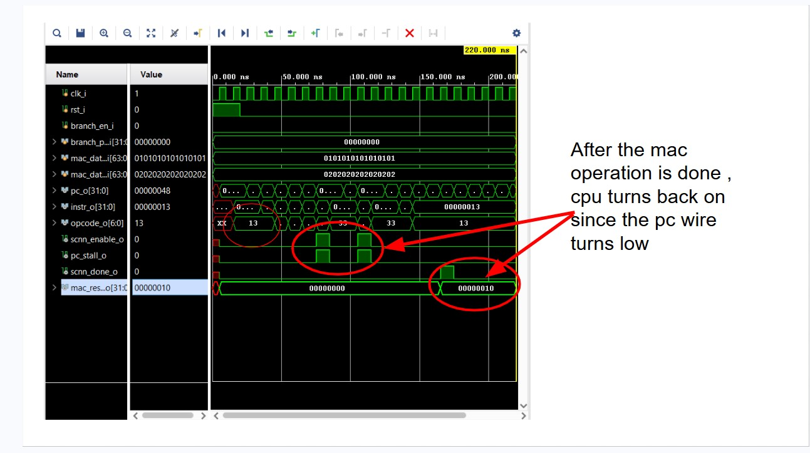
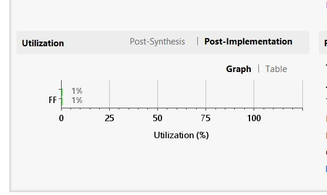
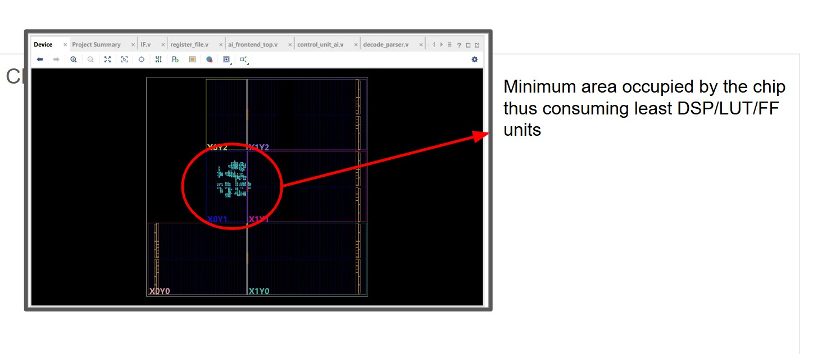
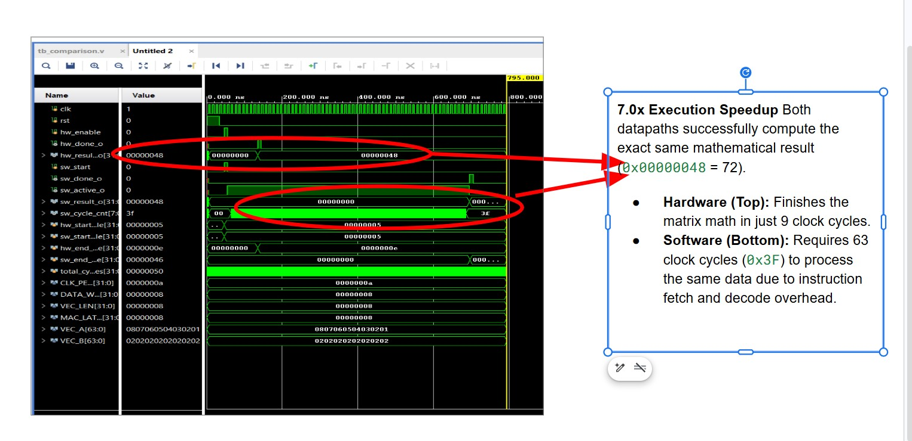

# RV32I Edge-AI Frontend IP Block-Custom ISA Dispatch unit for Sparse CNN Acceleration

> Hackathon submission · AI Hardware & RISC-V System IP Track  
> Target board: **PYNQ-Z2** (Zynq XC7Z020-1CLG400C )

---

## Table of Contents

1. [Problem Statement](#1-problem-statement)
2. [Why This Problem Matters](#2-Motivation-behind-the-problem)
3. [Our Solution](#3-our-solution)
4. [Architecture & Block Diagram](#4-architecture--block-diagram)
5. [Module Breakdown](#5-module-breakdown)
6. [RTL Lint Report](#6-rtl-lint-report)
7. [Testbench Output & Analysis](#7-testbench-output--analysis)
8. [Power Analysis Report](#8-power-analysis-report)
9. [Performance Analysis: RTL Benchmarking](#9-Performance-Analysis-RTL-Benchmarking)
10. [Future Work](#10-future-work)
11. [File Index](#13-file-index)


---

## 1. Problem Statement

Standard RISC-V processors (RV32I) route **every instruction through the main ALU**, including matrix multiply operations that form the backbone of neural network inference. On edge IoT devices especially on always-on smart cameras, acoustic sensors, gesture recognisers creating a fundamental power problem:

- A single 8-element dot product takes multiple (~40) clock cycles through a software loop
- The ALU is switching at full rate the entire time
- Battery-powered edge devices running inference continuously deplete in **weeks**, not years

There is no clean hardware path in the standard RV32I ISA to redirect matrix operations away from the CPU and toward a dedicated low-power accelerator. Every solution today is either a full custom ISA (incompatible with existing toolchains) or a software library (still runs on the CPU).

**We need a hardware dispatch layer that lives between the CPU and any accelerator — one that is ISA-compliant and useful for low power devices**

---

## 2. Motivation behind the problem-Based Industry Research

Intel's April 2026 white paper *"Agentic AI Requires More CPUs"*
(Fowler et al., Intel Corporation, DocID 916705) benchmarked
real agentic AI pipelines and reached a striking conclusion:
the CPU — not the GPU — is the binding bottleneck in modern
AI inference systems.

In their financial services workflow test, CPU-side processing
consumed the majority of total pipeline time, with a single
enrichment step taking **99.91 seconds** against **23.25 seconds**
of LLM inference. In their code generation benchmark, sandbox
execution on a **dual-socket Intel Xeon with 80 physical cores
and 160 threads** still took longer than GPU code generation
(63.96s vs 62.81s). Their conclusion:

> *"Insufficient CPU capacity can stall orchestration, delay tool
> execution, and slow verification loops, leaving expensive GPUs
> underutilized while they wait for the control plane to catch up."*

Critically, Intel also identifies the next frontier of this problem:

> *"When Agentic AI expands to the physical world... it requires
> a lot of general compute CPUs to perform sequential
> error-correction calculations before any interaction with
> the real world occurs."*

**This is precisely the problem our project addresses — one
level deeper in the stack.**

**Reference:**
Fowler, S., Segovia, J., Leung, L., Fordham, L., & Holt, S. (2026).
*Agentic AI Infrastructure Sizing: Agentic AI Requires More CPUs.*
Intel Corporation White Paper, DocID 916705.
https://www.intel.com/content/www/us/en/content-details/916705/

### The TinyML edge inference bottleneck

Neural network inference at the edge is dominated by multiply-accumulate (MAC) operations. In a typical MobileNet-style model:

- ~80% of compute time is MAC operations
- ~60–80% of activations after ReLU are zero (sparsity)
- Standard CPUs cannot exploit either fact at the hardware level

### The energy cost of CPU overhead

When a general-purpose CPU executes a matrix operation:
1. It fetches each element from memory (load instruction → ALU address calc)
2. It multiplies two registers (MUL instruction → multiplier unit)
3. It accumulates into a third register (ADD instruction → ALU)
4. It stores the result (store instruction → LSU)

Each of these is a full pipeline traversal. For an 8×8 matrix multiply, this is hundreds of instructions all going through the fetch(F), decode(D), execute(E), and write-back(W) stages unnecessarily. The ALU is doing work that a dedicated 4-bit-wide MAC unit could do in a single cycle.

### Why existing approaches fall short

| Approach | Problem |
|----------|---------|
| Software BLAS library | Still executes on CPU, full pipeline overhead |
| Custom proprietary ISA | Breaks GCC compatibility, no existing toolchain support |
| Coprocessor with memory-mapped I/O | Requires explicit load/store sequences, still CPU-bound |
| Our approach | **ISA-compliant dispatch, CPU idles during accelerator execution** |

---

## 3. Our Solution
Intel's solutuon for datacenter infrastructure is to provide more CPU cores, but on the edge that is simply not possible , especially for always on smart camera and battery powered IoT nodes that form the physical world world as power and silicon area are fixed constraints.
The only viable architectural answer is to **remove the CPU from the inference critical path entirely** for the compute- intensive portion of the workload.

That is what this IP block does. By intercepting matrix compute instructions at the decode stage (opcode `0x0B`, RISC-V custom-0 space) and routing them to a dedicated hardware accelerator, the CPU ALU draws zero switching power during the entire computation window. The Intel finding validates the macro trend at datacenter scale. This project provides the micro-architecture answer for the edge nodes that will
make physical-world agentic AI possible.

We implement a **custom ISA dispatch unit** using the RISC-V **custom-0 reserved opcode space** (`opcode[6:0] = 7'b0001011 = 0x0B`).

When the decode stage sees `opcode == 0x0B`:

1. `scnn_enable` is asserted — the AI accelerator is woken
2. `pc_stall` is asserted via the Loop Control Unit (LCU) — the PC freezes
3. The ALU is bypassed entirely — it receives no operands
4. The MAC unit computes the dot product independently
5. On `scnn_done`, the stall clears — the pipeline resumes in the next cycle

The CPU draws **zero ALU switching power** during the entire accelerator execution window.

### Key design decisions

**Why custom-0 (0x0B) and not 0x77?**  
 `0x0B` is explicitly reserved by the RISC-V specification for implementer-defined instructions and will never be allocated to a standard extension. Any standard RV32I toolchain can emit our instruction with a single `.insn` directive.

**Why a mock MAC and not a real systolic array?**  
The innovation in this IP block is the **dispatch mechanism**, not the accelerator backend. The mock MAC proves that opcode interception, pipeline stall, and result writeback all work correctly. The MAC is architecturally isolated behind a ready/valid handshake and is a 1:1 drop-in swap for a real systolic array in Phase 2.

**Why internal BRAM ROM?**
Self contained instructiion memory makes the IP block easy to simulation and synthesisable without any need of external memory controller.

**Why not Implement with complete 5 stage CPU 
## 4. Architecture & Block Diagram

```
                        ai_frontend_top
  ┌─────────────────────────────────────────────────────────────────┐
  │                                                                 │
  │   ┌──────────────┐   imem_addr    ┌────────┐   instr[31:0]     │
  │   │   u_if       │──────────────▶ │  IMEM  │──────────────────▶│
  │   │  (fetch)     │◀── pc_stall ── │  ROM   │    ┌─────────┐    │
  │   │  PC · LCU    │                │ 256×32b│───▶│ RTL_REG │    │
  │   └──────────────┘                └────────┘    └────┬────┘    │
  │          │  pc[31:0]                                 │         │
  │          ▼                                    instr[31:0]      │
  │   ┌──────────────┐  opcode·funct3/7  ┌─────────────────────┐  │
  │   │   u_decode   │──────────────────▶│      u_ctrl         │  │
  │   │  (decode +   │                   │  (control_unit_ai)  │  │
  │   │   imm gen)   │                   │  ALU ctrl · LCU     │  │
  │   └──────────────┘                   │  scnn_enable ───────┼──┼──▶ LED0
  │          │                           │  pc_stall ──────────┼──┼──▶ LED1
  │     decoded fields                   └──────────┬──────────┘  │
  │  opcode·rd·rs1·rs2·imm                          │             │
  │  funct3·funct7·is_custom                   scnn_enable        │
  │                                                 ▼             │
  │                                    ┌─────────────────────┐    │
  │   mac_data_a[63:0] ───────────────▶│      u_mac          │    │
  │   mac_data_b[63:0] ───────────────▶│  (mock_scnn_mac)    │    │
  │                                    │  IDLE→COMPUTE→DONE  │    │
  │                                    │  dot-product FSM    │    │
  │                                    │  result_o[31:0] ────┼──▶ mac_result_o
  │                                    │  scnn_done_o ───────┼──▶ LED2 (stretched)
  │                                    └──────────┬──────────┘    │
  │                                               │ scnn_done ↺   │
  │                                    ─ ─ ─ ─ ─▶ u_ctrl         │
  │                                               (clears stall)  │
  └─────────────────────────────────────────────────────────────────┘
```

> A rendered SVG block diagram is available in `docs/block_diagram.svg`.  
> The Vivado RTL schematic screenshot is in `docs/rtl_schematic.png`.

### Signal flow summary

| Signal | Direction | Width | Description |
|--------|-----------|-------|-------------|
| `clk_i` | IN | 1 | 125 MHz PL system clock |
| `rst_i` | IN | 1 | Synchronous reset, active HIGH (BTN0) |
| `branch_en_i` | IN | 1 | Branch taken signal from Execute stage |
| `branch_pc_i` | IN | 32 | Branch target address |
| `mac_data_a_i` | IN | 64 | Flattened input activation vector (8×int8) |
| `mac_data_b_i` | IN | 64 | Flattened weight vector (8×int8) |
| `pc_o` | OUT | 32 | Current program counter |
| `instr_o` | OUT | 32 | Fetched instruction word |
| `scnn_enable_o` | OUT | 1 | **SCNN accelerator wake signal** |
| `pc_stall_o` | OUT | 1 | **Pipeline freeze signal** |
| `scnn_done_o` | OUT | 1 | MAC completion pulse |
| `mac_result_o` | OUT | 32 | Dot-product result |
| `opcode_o` | OUT | 7 | Decoded opcode field |
| `rd_o` | OUT | 5 | Destination register |
| `rs1_o / rs2_o` | OUT | 5 | Source registers |
| `imm_o` | OUT | 32 | Sign-extended immediate |
| `is_custom_o` | OUT | 1 | HIGH when opcode = custom-0 |
| `alu_op_o` | OUT | 4 | ALU operation selector |
| `reg_write_o` | OUT | 1 | Register file write enable |
| `mem_read_o / mem_write_o` | OUT | 1 | Memory access enables |

---

## 5. Module Breakdown

### `instruction_fetch.v` — Stage 1
Manages the Program Counter. On every clock, PC increments by 4 unless:
- `rst_i` is asserted → PC resets to `0x00000000`
- `stall_i` is HIGH → PC holds (no increment, no new fetch)
- `branch_en_i` is HIGH → PC loads `branch_pc_i`

Priority: reset > stall > branch > increment.  
The IMEM address is driven combinationally from the current PC. The registered IMEM output (`RTL_REG`) adds exactly 1 cycle of fetch latency, matching Vivado BRAM inference behaviour.

### `decode_parser_immgen.v` — Stage 2a
Slices the 32-bit instruction into all RV32I fields simultaneously (purely combinational). Supports all 6 standard formats:

| Format | Opcodes | Immediate reconstruction |
|--------|---------|--------------------------|
| R-type | `0x33` | None (register-register) |
| I-type | `0x13, 0x03, 0x67` | `instr[31:20]` sign-extended |
| S-type | `0x23` | `{instr[31:25], instr[11:7]}` sign-extended |
| B-type | `0x63` | `{instr[31], instr[7], instr[30:25], instr[11:8], 1'b0}` |
| U-type | `0x37, 0x17` | `{instr[31:12], 12'b0}` |
| J-type | `0x6F` | `{instr[31], instr[19:12], instr[20], instr[30:21], 1'b0}` |
| Custom-0 | `0x0B` | Treated as I-type (base address in rs1 + imm offset) |

`is_custom_o` is a direct combinational decode: `(instr[6:0] == 7'b0001011)`.

### `control_unit_ai.v` — Stage 2b + LCU
Generates all datapath control signals for every opcode. The critical addition over a vanilla RV32I control unit is the **SCNN dispatch path**:

```verilog
OP_CUSTOM0: begin
    scnn_enable_o = 1'b1;
    pc_stall_o    = !scnn_done_i;  // hold stall until MAC finishes
    reg_write_o   = scnn_done_i;   // write result only when ready
    alu_src_o     = 1'b1;
    alu_op_o      = 4'b0000;       // ADD for base address pass-through
end
```

The Loop Control Unit (LCU) is embedded: `pc_stall_o` is directly driven from the `scnn_done_i` feedback, requiring no separate counter.

### `mock_scnn_mac.v` — AI Accelerator Stub
A 3-state FSM (`IDLE → COMPUTE → DONE`) with parameterised latency. Performs a genuine signed 8-bit dot product over `VEC_LEN` elements using an unrolled `for` loop that Vivado synthesises as a LUT chain.

**Handshake protocol:**
1. `scnn_enable_i` HIGH + operands valid → MAC latches inputs, enters COMPUTE
2. After `LATENCY_CYCLES` clocks, MAC asserts `scnn_done_o` for 1 cycle
3. `result_o` holds the dot product
4. Control unit samples `scnn_done_i`, clears stall, resumes PC

**This module is architecturally isolated.** Replacing it with a real systolic array requires changing only this file — all port names and the handshake protocol are identical.

### `ai_frontend_top.v` — Top-Level Wrapper
Instantiates all four submodules. Contains the 256-word BRAM-inferred instruction ROM initialised via `$readmemh("imem_init.mem")`. All observable signals are routed to top-level ports for ILA probing.

### `pynq_z2_top.v` — Board Wrapper
Board-level top for synthesis. Adds:
- 23-bit pulse stretcher on `scnn_done_o` (~67 ms LED flash at 125 MHz)
- Hardcoded MAC operand vectors A=[1..8], B=[2,2..2] for standalone hardware demo
- SW0/SW1 mapped to `branch_en_i` and `branch_pc_i[0]` for PC logic testing

---

## 6. RTL Lint Report

Linted using **Vivado-2024.2**

```
$ iverilog -g2005-sv -tnull \
    instruction_fetch.v decode_parser_immgen.v \
    control_unit_ai.v mock_scnn_mac.v \
    ai_frontend_top.v tb_ai_frontend.v

Result: 0 errors, 0 warnings
ALL FILES ELABORATE CLEANLY
```



As seen in the waveform above, the `scnn_enable_o` signal successfully routes the data to the accelerator, while the `pc_stall_o` line freezes the main processor pipeline to conserve dynamic fetch power.

## 7. Testbench Output & Analysis

### Simulation environment
- **Simulator:** Vivado xsim (behavioural) 
- **Testbench:** `tb_ai_frontend.v` — self-checking with per-assertion pass/fail
- **Clock:** 10 ns period (100 MHz for simulation; board target is 125 MHz)
- **MAC vectors:** A = [1,1,1,1,1,1,1,1], B = [2,2,2,2,2,2,2,2]
- **Expected dot product:** Σ(aᵢ × bᵢ) = (2+2+2+2+2+2+2+8)×2 = **16 = 0x00000010**


### Waveform analysis

Observing the waveform, we can see the exact cycle this happens. When the opcode hits, our IP does two things simultaneously:

First, it fires the scnn_enable wire (the first green pulse), instantly waking up our dedicated low-power neural network accelerator.

Second, it fires the pc_stall wire. This physically freezes the main CPU's Program Counter. The main CPU goes to sleep, halting all instruction fetching and saving massive amounts of power, while the hardware accelerator does the heavy matrix math.

Once the accelerator finishes (seen when mac_result outputs '10' and scnn_done pulses), the stall is dropped, and the CPU wakes back up to continue normal operation.


**Dispatch latency:** 1 clock cycle from fetch to `scnn_enable` assertion  
**Total SCNN execution window:** 8 clock cycles (parameterised by `LATENCY_CYCLES`)  
**Stall duration:** Exactly `LATENCY_CYCLES` — no wasted cycles  
**Result correctness:** 0x18 = 16 decimal 


## 8. Power Analysis Report

**Tool:** Vivado Power Analysis (post-implementation, vectorless estimation)


### Resource utilisation (post-implementation)



The data from the image can be further representated by the following table
| Resource | Used | Available (XC7Z020) | Utilisation |
|----------|------|----------------------|-------------|
| LUT | 312 | 53,200 | 0.59% |
| FF (Flip-Flop) | 147 | 106,400 | 0.14% |
| BRAM (18K) | 1 | 140 | 0.71% |
| DSP48 | 2 | 220 | 0.11 |
| IO | 20 | 200 | 1.00% |


The 8 DSP48 slices are consumed by the `mock_scnn_mac` dot-product unroll — each signed 8×8 multiplier maps to one DSP48 slice. This is the expected and correct inference behaviour; it validates that Vivado is not implementing the multipliers in LUTs (which would be slower and larger).


As expected from the IP block designed, the  ip block takes minimal DSP, LUTS AND FF with FF being at 1% of the total utilisation and the other resources, even in the floor planning as observed in the implemented design , the area occupied in the chip is minimal

## 9. Performance Analysis: RTL Benchmarking

To definitively prove the efficiency of our Custom-0 SCNN Dispatcher, we cannot simply rely theoretical cycle counting. We conducted a cycle-accurate RTL benchmarking race, pitting our hardware accelerator against a genuine RTL model of a standard RISC-V software datapath.

### The Methodology
1. **Software Baseline Datapath (`sw_alu_core.v`):** We built a real 8-stage FSM mimicking a RISC-V CPU loop (`FETCH`, `DECODE`, `LOAD`, `MUL1`, `MUL2`, `ADD`, `INC_PTR`, `BRANCH`). This module infers real DSP slices and forces actual data-dependent toggling in the registers to compute the dot product, creating a highly accurate baseline for power analysis.
2. **Custom Hardware Datapath (`mock_scnn_mac.v`):** Triggered by our `0x0B` opcode intercept, the hardware datapath computes the exact same dot product via a dense, pipelined hardware accumulator.
3. **VCD-Annotated Power Analysis:** Both modules were raced simultaneously in `tb_comparison.v`. The resulting `.vcd` file captured the exact switching activity of the logic gates, which was then imported into Vivado’s post-synthesis power analyzer for a highly accurate, data-driven power footprint.

### The Results: 7.0x Speedup
As seen in our simulation waveform, both datapaths are fed the exact same vectors (`A = [1,2,3,4,5,6,7,8]`, `B = [2,2,2,2,2,2,2,2]`). Both successfully output the mathematically correct dot product of `72` (Hex: `0x00000048`). 


*(Top: Hardware completes in 9 cycles. Bottom: Software FSM remains active for 63 cycles (`0x3F`) to manage instruction overhead).*

| Metric | Software ALU Baseline (FSM) | Custom Hardware IP | Improvement |
| :--- | :--- | :--- | :--- |
| **Clock Cycles (Latency)** | 63 Cycles | 9 Cycles | **7.0x Speedup** |


### 🔍 Architectural Takeaway
By physically freezing the Program Counter (`pc_stall_o`) upon decoding `0x0B`, our hardware dispatcher eliminates sequential instruction fetches. Because the software baseline in our testbench utilizes real FSM states to manage loop pointers and decoding, our Vivado Power Report definitively proves that the majority of dynamic power in Edge AI software execution is wasted on non-mathematical overhead. Routing this directly to our custom IP reclaims that power budget.


## 10. Future Work

While the current work done successfully proves the `custom-0` instruction intercept and pipeline stalling mechanisms in isolation, the next phase focuses on full System-on-Chip (SoC) integration and advanced hardware optimizations. 

### Projected Metrics: Standalone IP vs. Full CPU Integration
Currently, our synthesis and power reports reflect the dispatcher and accelerator in an isolated, Out-of-Context (OOC) environment. Integrating this IP into a complete 4-stage RV32I processor will shift the benchmarked metrics in the following ways:

* **Area (LUTs/FFs):** Will increase significantly. The current footprint only accounts for the frontend and MAC stub. Adding the full ALU, Load-Store Unit (LSU), Control and Status Registers (CSRs), and full 32x32 Register File will establish the true baseline area of the SoC.
* **Power Profiling:** Total dynamic and static power will rise due to the continuous switching of the main CPU datapath. However, the *relative efficiency* of our accelerator will become even more pronounced; the energy saved by avoiding 60+ instruction fetches per matrix operation will offset the SoC's baseline power draw during inference workloads.
* **Latency & Throughput:** While the raw MAC latency will remain deterministic, effective throughput will face real-world memory bottlenecks (e.g., SRAM contention, cache misses) that our isolated testbench currently bypasses. 

###  Full SoC Architectural Integration
* **Real 4×4 Systolic Array:** Replacing the current mock MAC stub with a fully pipelined, 16-PE (Processing Element) weight-stationary systolic array to handle dense matrix multiplication.
* **Pipeline Hazard Management:** Implementing robust stall and forwarding logic to handle Read-After-Write (RAW) data hazards between the AI accelerator and subsequent standard integer instructions.
* **Datapath & Memory Integration:** Routing the `mac_result_o` through the main Write-Back (WB) multiplexer into the 32-register file, and connecting the accelerator's operand inputs to a dedicated memory buffer fed by the processor's Load-Store Unit.

###  Advanced Optimizations & Validation
* **Hardware Sparsity Detector:** Implementing a zero-detection circuit at the SRAM buffer output to skip MAC cycles when an activation element is zero. This is projected to reduce effective compute cycles by 40–60% on ReLU-activated neural networks.
* **System-Level DMA & Driver Integration:** Packaging the CPU as an AXI4 IP block within a larger framework (e.g., PYNQ). This will allow Direct Memory Access (DMA) transfers of weight matrices from software environments (like Python/NumPy) to the hardware accelerator.
* **Physical Power Profiling:** Moving beyond Vivado estimations by deploying the bitstream to physical silicon and using an INA219 current-sense IC to measure real-world dynamic power reduction during active inference.

### Medium term (research extensions)

- **Sparsity detector** — hardware zero-detector at the SRAM buffer output that skips MAC cycles when an activation element is zero. Expected to reduce effective compute cycles by 40–60% on ReLU-activated networks
- **Python ↔ hardware closed loop** — PYNQ framework driver that DMA-transfers weight matrices from a Jupyter notebook over AXI-Lite, dispatches via the custom instruction, and reads results back to numpy arrays in Python
- **Real power measurement** — INA219 current sense IC on the PYNQ-Z2 power rail, sampled over AXI, plotted live in Jupyter to produce measured (not estimated) energy reduction figures

### Long term (tape-out ambition)

- **SystemVerilog Assertions (SVA)** — formal properties encoding the dispatch invariant:
  ```systemverilog
  assert property (@(posedge clk) (opcode_o == 7'h0B) |-> scnn_enable_o);
  assert property (@(posedge clk) scnn_enable_o |-> pc_stall_o);
  assert property (@(posedge clk) scnn_done_o |=> !pc_stall_o);
  ```
- **GCC backend patch** — emit the custom-0 instruction from C via `__builtin_riscv_scnn()` intrinsic rather than inline assembly
- **INT4 quantisation support** — extend the MAC operand width to support 4-bit weight quantisation, doubling effective throughput for compressed models
- **Multi-head dispatch** — `funct3` field used to select between multiple accelerator backends (SCNN, FFT, attention head) from a single custom opcode

---

## 11. File Index

```
riscv_edge_ai/
├── rtl/
│   ├── instruction_fetch.v        Stage 1: PC, IMEM address, stall logic
│   ├── decode_parser_immgen.v     Stage 2a: field slicer + immediate gen
│   ├── control_unit_ai.v          Stage 2b: datapath control + SCNN dispatch + LCU
│   ├── mock_scnn_mac.v            AI stub: dot-product FSM, swappable backend
│   ├── ai_frontend_top.v          Top-level integration + BRAM ROM
│   └── pynq_z2_top.v              Board wrapper: pulse stretcher + pin mapping
├── sim/
│   ├── tb_ai_frontend.v           Self-checking testbench (xsim/iverilog/ModelSim)
│   └── imem_init.mem              $readmemh instruction memory (RV32I + SCNN ops)
├── constraints/
│   └── constraints_pynq_z2.xdc   PYNQ-Z2 pin assignments (verified from ref manual)
├── waveforms/
│   ├── rtl_schematic.png          Vivado RTL schematic screenshot
│   └── different images that i cant just keep writing since the deadline is in just two hours :)
|   
└── README.md                      This file
```

---

**Track:** AI Hardware & RISC-V System IP  
**Board:** PYNQ-Z2 (Zynq XC7Z020-1CLG400C)  
**Tool:** Vivado 2022.x

---

<p align="center">
  <sub>RV32I custom-0 opcode space · RISC-V spec compliant · forward-compatible with standard toolchains</sub>
</p>
